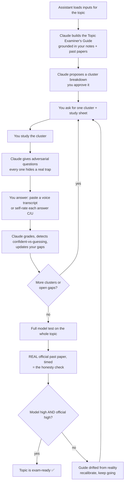

# System Map — How the Exam Backcasting System Works

> **Audience:** the student and their assistant. Read this first. It explains *why* the system exists,
> *how* it thinks, and *what each person does*. The technical rulebook is `CLAUDE.md` + `system/spec.md`;
> you don't need those to use the system — you need this.

---

## 1. The one-sentence version

You work **backwards from how the exam actually thinks** — reverse-engineering how the examiner sets
and marks questions — then hunt down the specific gaps between you and that standard, and refuse to
call yourself "ready" until a **real past paper** proves it.

---

## 2. First principles (why this exists)

**The problem.** Most revision feels productive but isn't. You re-read what you already understand,
your confidence rises, and then the exam tests the things you *didn't* know — in formats you didn't
practise. **The feeling of readiness is not the same as being ready.** Worse, two silent killers go
undetected:
- **Confident but wrong** — you're sure, and you're wrong. This is the most dangerous state, and
  normal studying never catches it.
- **Right but guessing** — you got the mark by luck. That's not mastery, but a score sheet can't tell
  the difference.

**The insight: backcasting.** Instead of "learn everything and hope," you start from the *destination*
— how this specific exam (Singapore A-Level, SEAB/Cambridge) sets and rewards answers — and walk
backwards to find exactly where you fall short. The system builds an **examiner's guide** (a model of
how the exam thinks), tests you **adversarially** (every question hides a real trap the examiner
actually uses), and tracks each weakness until it's genuinely closed.

**Two rules that keep it honest:**
1. **Everything is grounded in real materials** — your syllabus, your past papers, your notes. The
   system never invents content and presents it as fact. If it has to guess, it says so.
2. **High scores are not the goal.** The practice questions are *designed* to be hard. The goal is
   **zero open gaps + a real past paper passed under timed conditions.** Nothing else counts as ready.

---

## 3. The three roles (who does what)

| Role          | Who                 | Does                                                                                                                                 | Does **not**                                              |
| ------------- | ------------------- | ------------------------------------------------------------------------------------------------------------------------------------ | --------------------------------------------------------- |
| **Assistant** | the client's helper | Loads raw materials into `inputs/` (past papers, syllabus, mark schemes, notes, model answers), organized by subject → level → topic | Run study sessions or touch anything the system generates |
| **Student**   | the client          | Picks topics, studies, answers questions, sends a voice transcript or self-rates answers, takes the official papers                  | Hand-edit the tracking files (it breaks the history)      |
| **Claude**    | the engine          | Builds *everything generated*: examiner's guides, clusters, study sheets, questions, gap tracking, the next session's questions      | Auto-start sessions, predict your grade, or over-generate |

---

## 4. The two levels

```
LEVEL 1 — Subject Setup        (run ONCE per subject + level)
   raw materials  ─►  Subject Examiner's Guide   (how the whole subject is tested)

LEVEL 2 — Topic Sessions       (REPEAT per topic until "ready")
   pick a topic   ─►  study it   ─►  get tested   ─►  close gaps   ─►  prove it on a real paper
```

- A **subject** is e.g. *CSE H2*. Built once.
- A **topic** is a chapter/unit within it, e.g. *China's Governance*. You study these one at a time.
- Each topic is split into **clusters** (named sub-topics) you study one at a time, at your pace.

---

## 5. The lifecycle of one topic (the loop)



**How a gap closes (in plain words).** Every weakness lives in one of three states:

- **ACTIVE** — open. You got it wrong, or got it right but hesitated. Claude writes you a concept doc
  (and, for maths/calculation topics, variant problems to drill until it's mechanical).
- **FRAGILE** — you know it, but shakily, or you guessed right. Claude re-tests it from a *new angle*.
- **CLOSED** — you've nailed it **confidently, twice**. It never comes back.

A gap only closes when you prove it — not because you read the explanation. **Guessing right keeps it
open.** That's the anti-bullshit core of the whole system.

---

## 6. The map (where everything lives)

```
Singapore A-Level Exam Backcasting/
│
├── SYSTEM_MAP.md      ← this file (start here)
├── README.md          ← quick reference
├── CLAUDE.md          ← the rulebook Claude follows every session
│
├── system/            ← the system's brain (you don't edit this)
│   ├── spec.md            the full logic (single source of truth)
│   ├── subjects.md        which subjects/levels exist + how each closes gaps
│   ├── prompts/           the conversational entry points Claude uses
│   ├── playbooks/         the step-by-step mechanics Claude follows
│   └── templates/         blank shapes so every file looks the same
│
├── inputs/            ← ASSISTANT fills this (raw materials)
│   └── [Subject]/[H2|H1]/[Topic]/{past_papers, official_docs, chapter_notes, model_answers, school_resources}/
│
├── [Subject]/[H2|H1]/ ← CLAUDE generates this as you study
│   ├── subject_examiner_guide.md
│   └── [Topic]/  examiner_guide.md · study sheets · gap tracking · tests
│
└── gaps/              ← CLAUDE generates this (your weak spots, rolled up per topic)
```

**Rule of thumb:** `inputs/` = what *you* put in. `system/` = the brain (leave it alone). Everything
else = what Claude produces from the two.

---

## 7. How to use it — by role

### If you're the **assistant** (loading materials)
1. Open `inputs/_README.md` — it has the exact rules.
2. For the topic being studied, create `inputs/[Subject]/[Level]/[Topic_Name]/` and drop materials into
   the five subfolders. Use underscores, real names (`China_Governance`, not `Topic_1`).
3. Make sure the **3 minimum inputs** are present: **past papers**, **official docs (syllabus + mark
   schemes)**, and **mark schemes OR model answers**. If one is missing, leave a note — the guide
   will carry a lower confidence ceiling.
4. That's it. You don't run sessions.

### If you're the **student** (studying), just talk to Claude:
- *"Build the CSE H2 subject guide from the inputs."*
- *"I want to study [topic] for CSE H2."* → Claude grounds it in your notes, builds the topic guide,
  proposes clusters, waits for your approval.
- *"Generate the next cluster."* → one cluster + a study sheet.
- *"Give me questions on this cluster."* → an adversarial set.
- *"Here's my transcript:"* (paste it) — or answer with a **C** (confident) / **U** (uncertain) tag per
  question. Claude grades, shows you where you were guessing, and updates your gaps.
- *"Are we ready on this topic?"* → Claude checks the three readiness conditions.

> **Voice transcripts are session-only.** Paste them in; the system reads them for hesitation and
> never saves them to disk. Your spoken answers are not stored.

---

## 8. The pilot: CSE, first chapter (the concrete first run)

This is exactly the flow you described, step by step:

1. **Assistant populates CSE.** Loads CSE H2 materials into
   `inputs/CSE/H2/[Topic]/...` — past papers, the syllabus + mark schemes, chapter notes, model answers.
2. **Build the subject guide.** Student tells Claude: *"Build the CSE H2 subject guide from the
   inputs."* Claude ingests the CSE inputs first, researches official SEAB/Cambridge sources to fill
   gaps, runs the 90% validation check, and saves `CSE/H2/subject_examiner_guide.md`.
   *(Optional but recommended: drop your gold-standard CSE example into `system/prompts/` first so it
   sets the quality bar — see `system/prompts/_README.md`.)*
3. **Study the first chapter.** Student: *"I want to study [first chapter] for CSE H2."* Claude builds
   the topic guide (grounded in that chapter's notes/papers), proposes clusters, and waits for
   approval. Student works through clusters and answers the adversarial questions.
4. **Feedback to you.** After the session, the student tells you how it went; the system's own record
   (gap tracking under `CSE/H2/[Topic]/` and `gaps/CSE/H2/`) shows objectively where the real
   weaknesses are — that's the structured feedback, beyond "it felt fine."

---

## 9. What you can trust — and what it won't do

**Trust:**
- Guides are **grounded in your actual materials first**; anything inferred is tagged and flagged.
- The system surfaces **confident-but-wrong** and **lucky-guess** gaps that ordinary revision hides.
- "Ready" requires a **real official past paper**, not just good practice scores.

**It will NOT:**
- Predict your grade (it shows readiness gaps, not promises).
- Store your voice transcripts.
- Auto-start sessions or dump all clusters on you at once — it moves at your pace.
- Pretend to be confident when the inputs are thin — it tells you the ceiling instead.

---

## 10. Where it lives (hosting)

This whole folder is designed to live in **git** so it stays versioned and upgradeable: the *brain*
(`system/`, `CLAUDE.md`, this map) improves over time, while your study content and inputs are handled
per the chosen privacy settings. See the repository's hosting notes / ask the operator for the clone
link and what's included.
